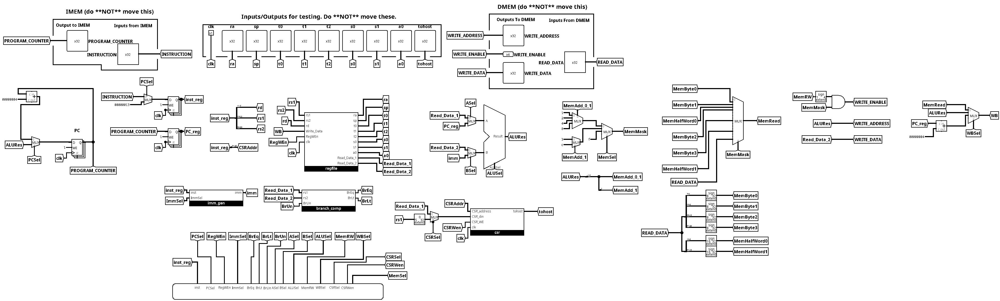
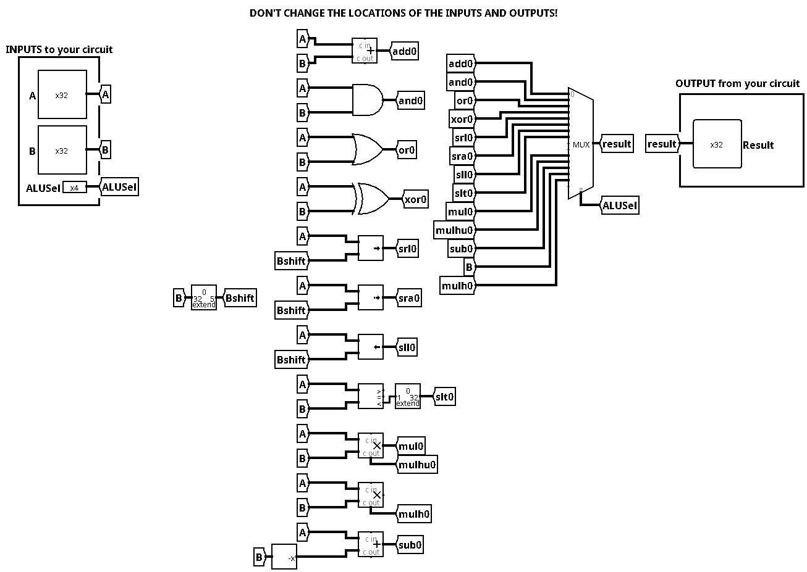
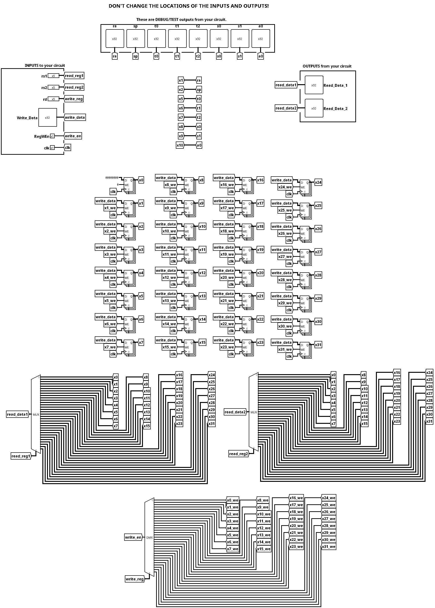
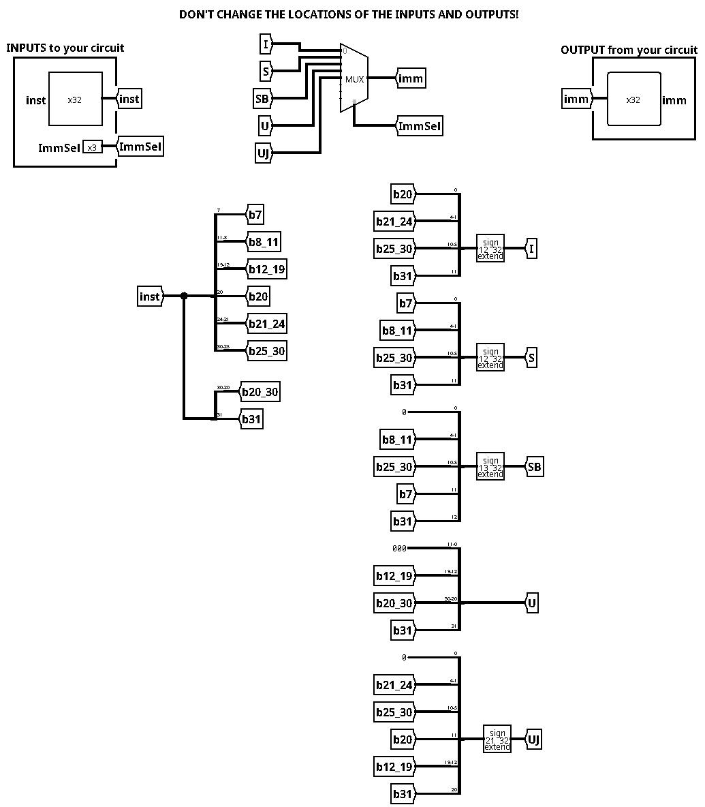
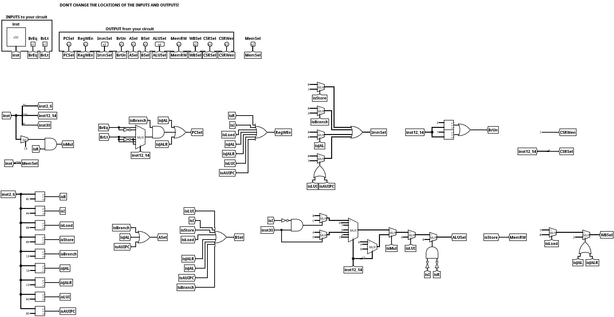
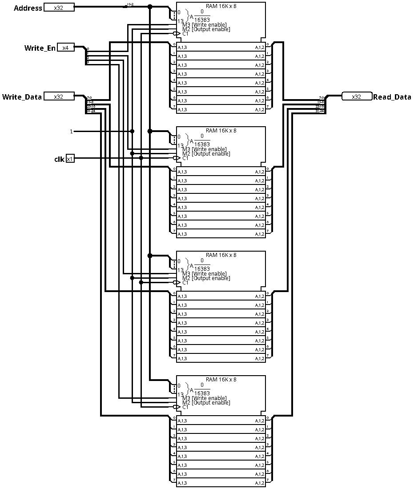
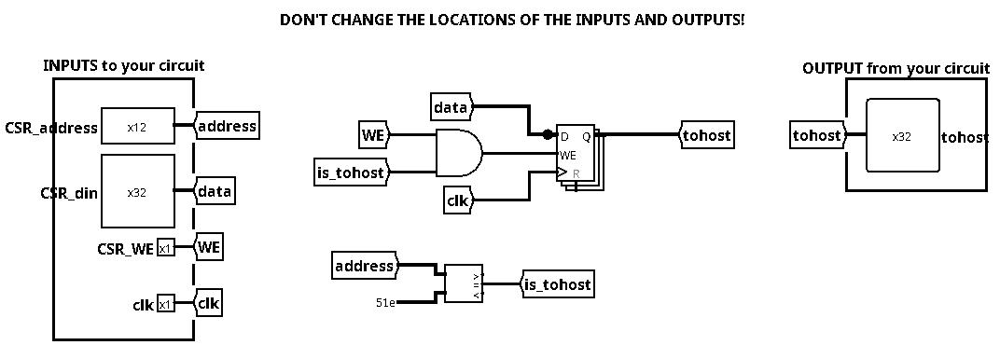
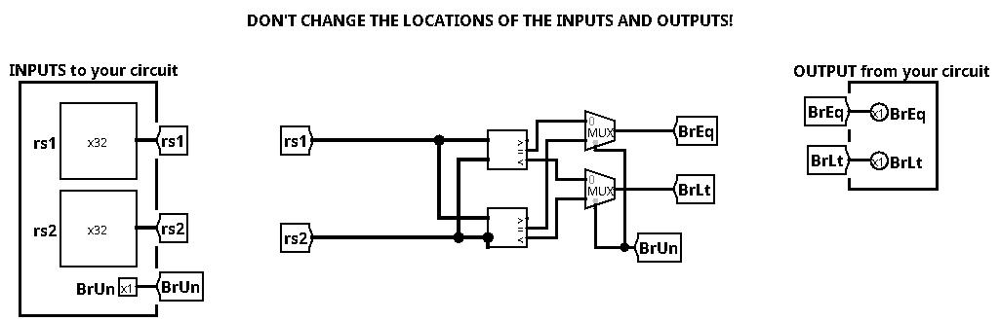

# CS61CPU: RISC-V 32-bit CPU Implementation

Welcome to the CS61CPU project! This repository contains a complete implementation of a 32-bit RISC-V CPU designed using Logisim-Evolution. This CPU features a 2-stage pipeline and supports a comprehensive subset of the RISC-V ISA.

## Table of Contents
- [Overview](#overview)
- [Architecture](#architecture)
- [Components](#components)
  - [Arithmetic Logic Unit (ALU)](#arithmetic-logic-unit-alu)
  - [Register File](#register-file)
  - [Immediate Generator](#immediate-generator)
  - [Control Logic](#control-logic)
  - [Memory System](#memory-system)
- [Instruction Set Support](#instruction-set-support)
- [Pipelining and Hazards](#pipelining-and-hazards)
- [Testing](#testing)
  - [Custom Tests](#custom-tests)

## Overview
The CS61CPU is a 2-stage pipelined processor capable of executing RISC-V instructions. The design is modular, with specialized components for instruction fetching, decoding, execution, and memory access. It is optimized for correctness and follows the standard RISC-V calling conventions.

## Architecture
The CPU follows a classic RISC-V datapath, split into two main pipeline stages to improve throughput while managing complexity.



## Components

### Arithmetic Logic Unit (ALU)
The ALU is the core computational unit, supporting arithmetic, logical, and shift operations. It also handles multiplication through specialized sub-circuits.



**Supported Operations:**
- Arithmetic: `add`, `sub`
- Logical: `and`, `or`, `xor`
- Shifts: `sll`, `srl`, `sra`
- Comparisons: `slt`
- Multiplication: `mul`, `mulh`, `mulhu`

### Register File
The register file contains 32 general-purpose registers (`x0` to `x31`). `x0` is hardwired to zero. The implementation ensures proper reading and writing during the pipeline stages.



### Immediate Generator
The Immediate Generator (ImmGen) extracts and sign-extends immediate values from various instruction formats (I, S, B, U, J).



### Control Logic
The Control Logic unit decodes instructions and generates the necessary control signals for the datapath, including ALU selection, register write enables, and memory controls.



### Memory System
The memory component handles data storage and retrieval, supporting byte (`lb`/`sb`), halfword (`lh`/`sh`), and word (`lw`/`sw`) operations with proper alignment and sign extension.



### CSR and Branch Comparator
- **CSR:** Handles Control and Status Registers, including `csrw` and `csrwi`.
- **Branch Comp:** Compares register values to determine branch outcomes.

| CSR | Branch Comparator |
|-----|-------------------|
|  |  |

## Instruction Set Support
The CPU supports the following instructions:
- **R-type:** `add`, `sub`, `sll`, `slt`, `xor`, `srl`, `sra`, `or`, `and`, `mul`, `mulh`, `mulhu`
- **I-type:** `addi`, `slli`, `slti`, `xori`, `srli`, `srai`, `ori`, `andi`, `lb`, `lh`, `lw`, `jalr`
- **S-type:** `sb`, `sh`, `sw`
- **B-type:** `beq`, `bne`, `blt`, `bge`, `bltu`, `bgeu`
- **U-type:** `auipc`, `lui`
- **J-type:** `jal`
- **System:** `csrw`, `csrwi`

## Pipelining and Hazards
This implementation uses a **2-stage pipeline**:
1. **Instruction Fetch (IF):** Fetches the instruction from memory.
2. **Execute (EX):** Decodes, reads registers, executes ALU operations, accesses memory, and writes back to registers.

To handle the 1-cycle branch delay, the CPU implements a simple stall/flush mechanism or ensures that the next instruction is correctly managed to maintain architectural correctness.

## Testing
The project includes a robust testing suite, including unit tests for every instruction and complex integration tests.

### Custom Tests
Beyond the standard sanity checks, several custom tests were implemented to verify edge cases and integration:
- **Unit Tests:** `add.s`, `sub.s`, `mul.s`, `shifts.s`, `logic.s`, `slt.s`
- **Integration Tests:** 
  - `factorial.s`: Calculates factorial recursively/iteratively.
  - `arr-sum.s`: Iterates through an array and sums its elements.
- **Edge Case Tests:**
  - `raw-hazard.s`: Tests Read-After-Write hazards in the pipeline.
  - `branch-to-next-inst.s`: Verifies branch logic when jumping to the immediate next instruction.
  - `mem-overwrite.s`: Ensures memory operations do not corrupt adjacent data.
  - `backward-jump.s`: Tests loops and backward jumping logic.

### Running Tests
To run all tests, use the provided Python script:
```bash
python3 test_runner.py
```
Specific tests can be found in `tests/part_a` and `tests/part_b`.
